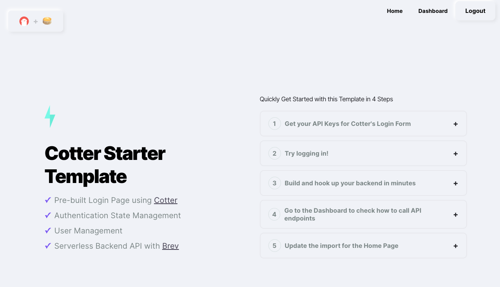
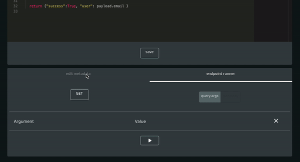
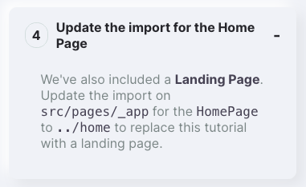
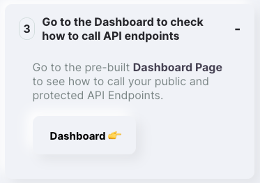

# Build a full app with user authentication

Time to complete: 10 minutes

Brev is the quickest and simplest way to get your backend up and running. We are huge fans of [Cotter](https://cotter.app) for user authentication. Together, it'll take about 10 minutes to have a full app up and running.

If you get stuck or have any questions, [please join our community slack](https://join.slack.com/t/brevworkspace/shared_invite/zt-hd999ii9-gzJOZnddyRJfzCV3iBLAhQ) and ping us for help!

## Step 1: Clone the starter project

**eta: 2 minutes**

Clone [this react starter project](https://github.com/cotter-code/react-starter-app). It has Cotter and Brev already hooked up.

- run `npm install`
- run `npm start` and go to http://localhost:3000
  You should see the following:
  
  <br/><br/>

## Step 2: Set up Cotter

**eta: 1 minutes**
Follow Step 1 from the starter: grab an API key from the Cotter dashboard and put it in src/apiKeys.js

## Step 3: Set up Brev to store Users

**eta 5 minutes**

- Head to https://app.brev.dev/signupalpha to create an account
- Create two <a href="/#?id=variables" target="_blank">variables</a>:

  1. COTTER, with the value being your cotter api key
  2. PUBLIC_KEY_LOCATION, with the value being "https://www.cotter.app/api/v0/token/jwks". Since we're using Cotter for auth, we'll need their public key to verify the Bearer token

- Add the following to <a href="/#?id=shared-code" target="_blank">shared code</a>:

```python
import variables
from pydantic import BaseModel

# The below classes are to map the incoming JSON for every new user
class User(BaseModel):
  ID: str
  created_at: str

class OauthToken(BaseModel):
  access_token: str
  id_token: str

class AuthPayload(BaseModel):
  email: str
  name: str
  oauth_token: OauthToken
  user: User

# validate the auth token with the Cotter public key
def validate_auth_token(bearer):
  # Getting jwt key
  r = requests.get(url = variables.PUBLIC_KEY_LOCATION)
  data = r.json()
  public_key = data["keys"][0];

  # Getting access token and validate it
  resp = jwt.decode(bearer, public_key, algorithms='ES256', audience=variables.COTTER)

  return resp
```

This will allow you to validate the authentication Bearer token coming from the front end.

- Create an endpoint and paste the following code:

```python
import variables
import shared
import sms
from jose import jwt
from global_storage import storage_context # Brev built in database
import requests

# return all users
def get(user_store = storage_context("users")):
  print(user_store.items())
  return {"users": [user_store[e] for e in user_store.keys()]}

# store users
def post(payload: shared.AuthPayload, user_store = storage_context("users")):

  # Getting access token and validate it
  token = payload.oauth_token.access_token
  resp = shared.validate_auth_token(token)

  # store user since it's valid and index by user_key for easy lookups
  user_key = resp['sub']
  user_store[user_key] = {
    "user_key": user_key,
    "name": payload.name,
    "email": payload.email
  }

  return {"success":True, "user": payload.email }
```

## Step 4: Give the endpoint a useful name

**eta <1 minute**

From [the app](https://app.brev.dev), open your endpoint and `edit metadata`. If you use a name other than "/users", be sure to update agent.ts in the react starter.


## Step 5: Hook up your frontend to your backend

**eta 1 minute**

Now all that's left is hooking up the front end react app secured by Cotter to your backend build on Brev

Your Brev endpoint URL will have a slug: http://`slug`.brev.dev/api/yourEPName
Paste the slug into line 8 of `agent.ts` on your react app.

```ts
const slug = "YOUR_BREV_PROJECT_SLUG";
const API_ROOT = `https://${slug}.brev.dev/api`;
```

## Step 6: Continue with the Cotter Tutorial!

**eta 1 minute**

Head back to the react app to finish up.

- Update the import to use the landing page template
  
  <br/><br/>

- Login to your app and View your dashboard of users!
  
  <br/><br/>
