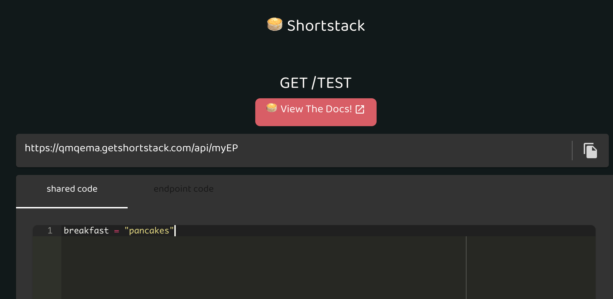
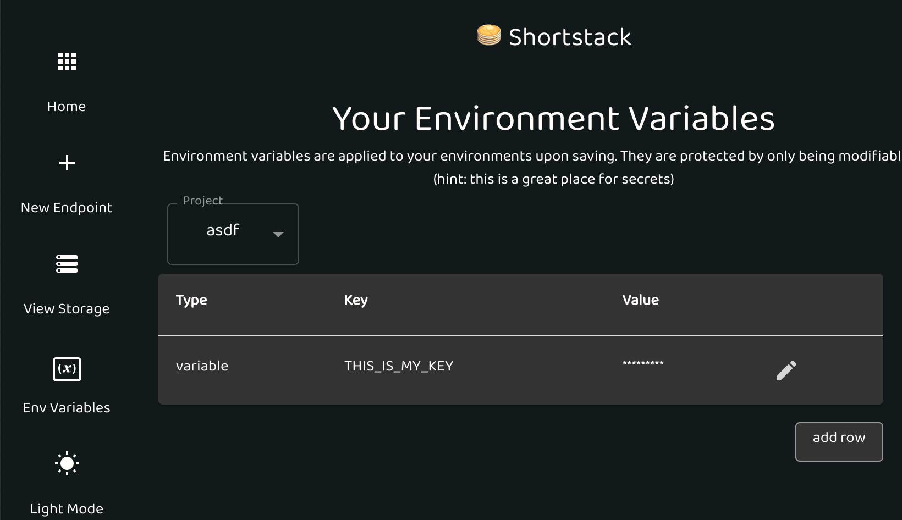
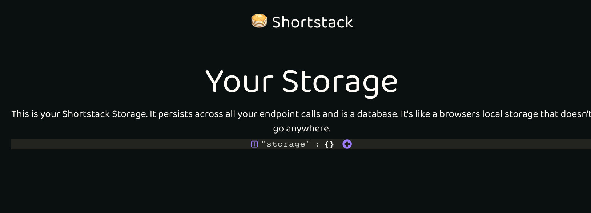
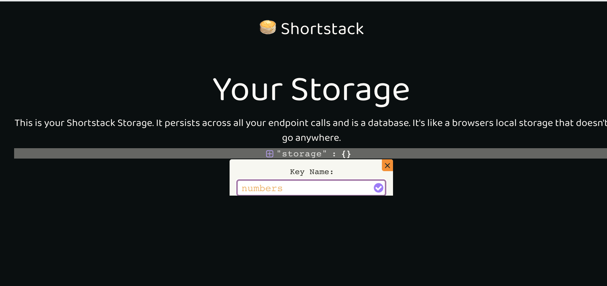
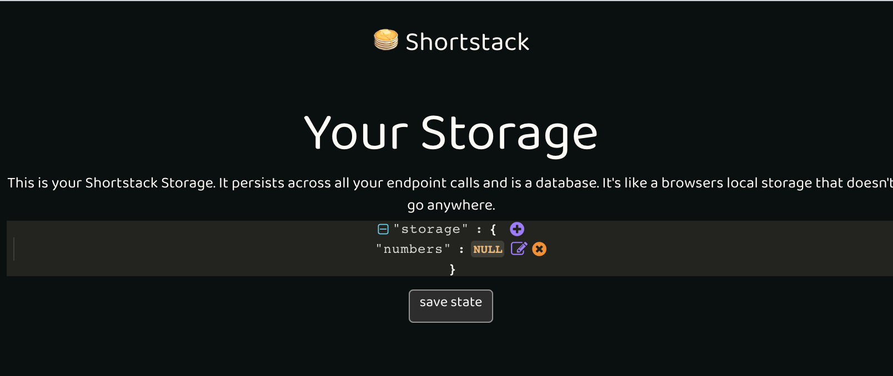
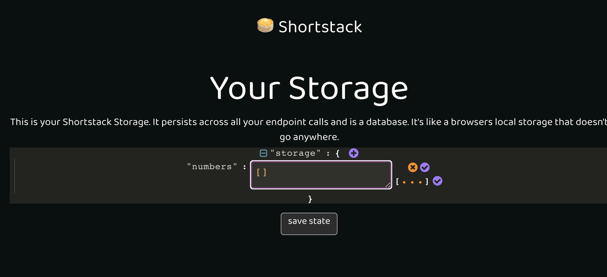

# Brev

Brev is a development environment that allows you to rapidly build and scale APIs. Brev aims to optimize for developer time without the tradeoff of vendor lockin.

**Highlighted Features**:

- **Production ready by default**: Scale without extra configuration or additional knowledge
- **Deployless**: Deployments just happen instantly when you save.
- **Configureless**: We handle the environments and infrastructure. Whether you're coding from the CLI and your local environment or the web app, the environment is ready to go.
- **Ergonomic request/response validation**: Use python3 type hints to define the shape of your request args and body.
- **Openapi by default**: Openapi specification is automatically generated for you as you write and annotate your endpoints
- **Secrets management**: Store your applications secrets securely without extra effort
- **Package management**: Use the power of python's community with 3rd party packages found on pypi
- **Shortstore:** A super simple nosql database to prototype your applications -- backed by Dynamodb.

**Coming Soon**:

Our roadmap is constantly evolving with feedback from our users. Here are some of the things we are thinking about.

- **Eject:** Eject your project at any point in your project to host it yourself and get under the hood. Access all the configuration details and more without worrying about them at the start of your project.
- **Project Environments:** Create multiple different isolated environments to develop or experiment on your APIs ex. (staging, prod, dev)
- **Cron Jobs** Create and manage cron jobs without any extra setup.
- **Application monitoring, alerting:** get crash alerts and performance monitoring out of the box or hook up (Sentry, APM, etc).
- **Robust Logging and Querying** Search and query for relevant logs to quickly debug your application

Use this quickstart guide to jump into Brev. If you have any lingering questions, [please e-mail us](nader+docs@brev.dev)

**Project Status**

[✓] Alpha: We are testing Brev with a small set of users.

[✓] Public Alpha: Join our waitlist and we will get you access as soon as we can. We hope you build something great! The platform still has kinks please help us iron them out.

[ ] Public Beta: Anyone can create an account. API becomes stable.

[ ] Public launch: Stable for enterprise use cases.

# User Guide

## Core Concepts

Brev lets you create projects. In each project, you'll find:

- Endpoints: Code that responds to http requests.
- Shared Code: Code that can be shared by any endpoint in a project
- Packages: Installable 3rd party packages from PyPi that can be used in endpoints or shared code
- Variables: A secure way to use and manage secrets, keys, passwords and is also a good way to manage environment variables or global constants in your code.
- Storage: A simple key value database. It can be thought of as a persistent dictionary accross requests as its api closely mirrors python's native dict type. It's a great way to build a proof of concept without needing to hook up a database.

## Quickstart

This requires a shorstack account. [Create one here](https://app.brev.dev/signup)!

Lets create a hello world project.

1. Navigate to the [endpoints page](https://app.brev.dev/endpoints).
2. Create a new endpoint by pressing the plus (+) sign in the side bar.
3. Enter a name for the endpoint we can call it `hello_world`.
4. Write the following python code in the editor.

```python
def get():
  return {"message": "hello world"}
```

5. Press the save endpoint button to deploy your code.
6. Run the endpoint by copying the url at the top of the page and entering it in a new tab or by pressing the play button at the bottom of the page.
7. You should see `{"message": "hello world"}` as the response :)

> **Hint**: Your url will look like `https://123456.brev.dev/api/_execute/89247f45-d47f-777-b8c9-91a20287faa6` ## Defining Endpoints

> **Technical Detail**: Brev is built on top of [FastApi](https://fastapi.tiangolo.com)/[Starlette](https://www.starlette.io) and supports much of its API. To dig deeper in request/response, validation and documenation it might be helpful to checkout their docs.

### Handling http methods

To handle different http methods for a given url, create new functions named with the http request type you would like to handle. The following methods are currently supported.

- get
- post
- put
- delete
- options
- head
- patch
- trace

Example:

```python
def get():
  return {"message":"GET"}

def post():
  return {"message": "POST"}
```

### Custom endpoint paths

To change an endpoint's url suffix to something more readable and useful, click on the `edit metadata` tab at the bottom of the editor and modify the url path. Once satisfied press save.

> **Hint**: Endpoints are immediately accessible by its url after it is saved.

### Sending data to your endpoints

There are currently 4 supported ways to send data to your endpoints.

- Path Parameters
- Query Arguments
- Request Body
- Request Files

#### Path params

Path params are parameters encoded as part of the url enclosed with `/`.

Ex:

- `/resource/1`
- `/resource/2/do_something`

To extract the value (ex. 1, 2) for our function to use, we need to modify the endpoint path. Click on the `edit metadata` tab at the bottom of the editor and modify the url path to `/resource/{resource_id}`.

Next add `resource_id` as an argument to your function definition to use it.

```python
def get(resource_id: int):
  return {"resource_id": resource_id}  # {"resource_id": 1}
```

> **Hint**: The type hint of `int` used will typecast the parameter or throw a http 422 error with a message on what was invalid.

#### Query Arguments

Query Arguments are parameters found at the end of url after `?` They are key value pairs joined with `=` character and separated by `&`.
Ex:

- `/resource?id=1`
- `/resource?type=2&filter=brita`

Simply add the query argument names as arguments in the function to use in the endpoint.

```python
def get(type: int):
  return {"type": type}  # {"type": 2}
```

To optionally accept a query parameter define the variable as a python keyword argument (default value).

```python
def get(type: int, filter=None):
  return {"type": type, "filter": filter}  # {"type": 2, "filter": "brita"}
```

#### Request Body

The request body is data sent from a client to your backend. Simply create a class representing the data in your body, and use the class as a type hint for the function argument in your endpoint.

```python
from typing import Optional
from pydantic import BaseModel

# The class for the  body to be matched
class ItemInBody(BaseModel):
  name: str
  email: str
  phone: Optional[str] = None

# add the class as a parameter
def post(item: ItemInBody):
  return item  # {"name": "Alec", "email": "email@mail.com", "phone": "123-456-7890"}
```

To test this we can use a tool like [Postman](https://www.postman.com), the Brev CLI, or you can use Shorstack's `endpoint runner` at the bottom of the editor. Select the `json body` editor and add a test request body and make sure the http method selected is `POST`. You can use this as a test request body:

```json
{ "name": "Alec", "email": "email@mail.com", "phone": "123-456-7890" }
```

Press the play button and you should see the `ItemInBody` type sent back as a json response.

To access and validate a json request body we use [Pydantic](https://pydantic-docs.helpmanual.io) models. The pydantic classes allow us to define what our data should be in plain python3 type hints.

> **Hint**: You can nest pydantic models.

> **Hint**: It is best practice to not use the http `GET` method to send response body's. It is undefined behavior in the specifications.

#### Request Files

To receive files sent as form data you can declare an argument with default value of `File(...)`.

```python
from fastapi import File
import file

def post(file_contents: bytes = File(...))

  # We're using our built in file uploader
  # see below for documentation on it
  link = file.upload(file_contents)

  return {"file_url": link}
```

You can specify file type as `UploadFile` to acess file meta data and handle the file more efficiently. See all of `UploadFile`'s [attributes here](https://fastapi.tiangolo.com/tutorial/request-files/#uploadfile).

```python
from fastapi import File, UploadFile
import file

await def post(uploaded_file: UploadFile = File(...))

  file_contents = await uploaded_file.read()

  link = file.upload(file_contents)

  return {"file_url": link, "file_name": uploaded_file.filename}
```

To handle multiple uploaded files, type hint the parameter as a `List`.

```python
from typing import List
from fastapi import File, UploadFile
import file

await def post(uploaded_files: List[UploadFile] = File(...))

  return {"file_names": [f.filename for f in uploaded_files]}
```

### Responses

Http responses are used to send data back to the client. Responses include a body, headers, cookies, and a status code.

As you have seen you can create a response by returning from an endpoint handler. By default the response status code is `200`. The object returned will be used as the body.

To return a custom response you can return a Starlette response object. Read more about [Starlette response objects here](https://www.starlette.io/responses/).

```python
from fastapi.responses import JSONResponse

def post():
  return JSONResponse(status_code=201, content={"message": "created"})
```

## Shared Code

You'll notice each endpoint editor has two tabs. The endpoint handlers are defined under _*Endpoint Code*_. _Shared Code_ allows you to construct functions and classes that are accessible by any endoint in a project.



You can access the shared code via the `shared` object in any endpoint. So the following will return pancakes

```python
import shared

def get():
  return {"breakfast": shared.breakfast}  # {"breakfast": "pancakes"}
```

## Variables

- `variables` is the Brev secrets/environment variables manager. You can access it [here](https://app.brev.dev/variables)

  1. Add any environment variable or secret on the Variables page. Note: these variables are protected per project.
     

  2. You can use any of your variables by the `variables` object in your endpoint code.
     For example:

  ```python
    variables.THIS_IS_MY_KEY
    def get():
      return {"var": variables.THIS_IS_MY_KEY}
  ```

## Shortstorage

Shortstorage is a minimal nosql key value store backed by Dynamodb.

Persist data between api calls within a project without further configuration. Shorstorage is not designed for high throughput applications. We recommend configuring a database designed for you applications read/write profile.

> **Technical Detail**: The database supports eventual consistency

> **Technical Detail**: Currently each project uses a single Dynamodb partition key. This works for most use cases but can be a bottle neck for high throughput applications.

### Python Usage

Shorstorage implements a very similar API to [python's Dictionary type](https://realpython.com/python-dicts/).

Access Shortstorage by importing `storage` and using `storage_context` as the default value for a keyword argument in an endpoint.

```python
import storage

def get(storager = storage.storage_context()):
  val = storager["key"]  # get item

  val = storager.get("key", "default")  # get item and return 'default' if 'key' does not exist

  storager["key"] = "value"  # set 'value' to 'key'

  val = storager.setdefault("key", "value")  # set 'value' if 'key' does not exist return stored value

  return {"value": val}
```

> **Hint**: As you access objects in shortstorage they are cached in each request. Once the endpoint is ready to repond, the changes are saved to the database.

> **Technical Detail**: The `storage_context` is implemented as a dependency/dependable. Read more about [FastAPI's lightweight depedency injection here](https://fastapi.tiangolo.com/tutorial/dependencies/).

#### Collections

By default when using Shortstorage all items are grouped under the `default` collection. To group objects together, declare different collections by specificying the name of the collection as the parameter of `storage_context`.

```python
from storage import storage_context

def get(user_store = storage_context("users"), item_store = storage_context("items")):
  user_id = "user_id"

  email = user_store[user_id]["email"]

  items = item_store[user_id]

  return {"email": email, "items": items}
```

### Using the View Editor

1. Hover your cursor over storage and click on the '+' icon that appears
   
2. Name this list. We'll call it numbers
   
3. Note the data type defaults to NULL. Hover your cursor over NULL and click on the edit(pencil) that appears
   
4. Replace null with empty brackets for a list and click the purple check on the right. Make sure the click the check next to [ ... ] to save the data type as a list instead of string
   

Yay! Your storage now has a list called numbers ready to use :)
In an endpoint, the following code would add phone numbers to the list!

### Shortstorage API reference

#### Types

The following types can be used as keys to Shortstorage

```python
StorageKey = typing.Union[int, str, bool, float]
```

The following is supported as values returned from Shortstorage

```python
StorageValue = typing.Union[StorageKey, None, List, Dict]
```

#### Dependable

```python
storage.storage_context(collection: str="default") -> fastapi.Depends
```

- Parameters
  - collection: a string to designate what collection of objects the storage context will be
- Returns: A fastapi dependable that creates a StorageContext yields the StorageContext then saves all changes made.

#### StorageContext

```python
class StorageContext:
```

The StorageContext api is similar to a python dict object. Objects are ordered by insertion.

```python
__getitem__(key: StorageKey) -> StorageValue
```

Implements `storage_context[key]` bracket notation. Raises a KeyError if item does not exist.

- Parameters
  - key: A `StorageKey` key to retrieve an object
- Returns: The object in storage if it exists in cache else retrieves from database

```python
__setitem__(self, key: StorageKey, value: StorageValue) -> None:
```

- Parameters
  - key: A `StorageKey` to be used for retrieval.
  - value: A `StorageValue` which is used as its value.
- Returns: The object in storage if it exists in cache else retrieves from database

```python
commit() -> None
```

Manually save session cache to database. This is automatically called after you return from a endpoint handler.

```python
get(key: StorageKey, default: Optional[StorageValue]=None) -> StorageValue
```

- Parameters
  - key: A `StorageKey` key to retrieve an object
  - default: the value to return if the object does not exist
- Returns: The object in storage if it exists in cache else retrieves from database

```python
update(to_update: Dict[StorageKey, StorageValue]) -> None
```

- Parameters
  - to_update: a dict to bulk update keys and values in the database
- Returns: None

```python
setdefault(key: StorageKey, default_value: StorageValue) -> StorageValue
```

Sets `default_value` as the value of `key` if key does not exist. Returns the value in the database,

- Parameters
  - key: A `StorageKey` key to retrieve an object
  - default: A `StorageValue` to be set if key does not exist
- Returns: A `StorageValue` object that is the value uses in Shorstorage

```python
___delitem___(key: StorageKey) -> None
```

Implements `del storage_context[key]` syntax. Removes object with `key` from Storage.

- Parameters
  - key: A `StorageKey` key to retrieve an object
- Returns: None

```python
pop(key: StorageKey) -> StorageValue
```

Removes object with `key` from Storage and returns removed object

- Parameters
  - key: A `StorageKey` key to retrieve an object
- Returns: `StorageValue` object in db

```python
clear() -> None
```

Removes all items from database in collection

```python
__len__() -> int
```

Implements `len(storage_context)` syntax. Returns number of items in the collection.

- Returns: An int of how many items are in the collection.

```python
__contains__(key: StorageKey) -> bool
```

Implements `key in storage_context` syntax. Returns bool if key exists in collection

- Parameters
  - key: A `StorageKey` key to retrieve an object
- Returns: A bool. True if key exists.

```python
keys() -> Iterable[StorageKey]
```

Retrieves all keys in a collection

- Returns: An iterable of keys

```python
values() -> Iterable[StorageValue]
```

Retrieves all values in a collection

- Returns: An iterable of `StorageValue`

```python
items() -> Iterable[Tuple(StorageKey, StorageValue)]
```

Retrieves all objects as an iterable tuple of StorageKey, StorageValue in a collection

- Returns: An iterable of `Tuple(StorageKey, StorageValue)`

# Brev Tools

Brev comes with many services configured with sane defaults out-of-the-box.

## SMS

`sms.send(phone_number: str, message: str)` is a simple way to send SMS messages. It comes from a real 10-digit number (not a short code). An exception will be thrown if the message fails to send.

```python
import sms

sms.send("415555555", "hello from Brev!")
```

## File Upload

Often you want to store files like images, videos, docs, or arbitrary binary data. Use `file.upload` to upload data. A long unique link will be returned that you can use to access the uploaded file. Anyone witgh access to this link will have access to the file.

```python
file.upload(data: Union[bytes, BinaryIO]) -> str
```

- Parameters
  - data: a file like object or bytes can be used.
- Returns: Returns a complete url with a long unique id. Anyone who has access to this link has access to the file.

# Examples

## Upload an Image

...

## Use of multiple parameter types

If we want to send meta data along with a file, we could use a request body with json and File object. To do so all we need to do is declare a pydantic model and use it as a type hint for a function argument.

```python
from pydantic import BaseModel
from fastapi import File

# The class for the json body to be matched
class AwesomePhoto(BaseModel):
  location: str
  name: str

# Your Endpoint function with the class as a parameter
def post(photo_meta: AwesomePhoto, file_content = File(...)):
  link = upload_blob(file_content)

  return {
  "photo_name": photo_meta.name,
  "location": photo_meta.location,
  "file_url": link
  }
```

# Brev CLI

If you have a development environment you like, you might prefer to
develop there rather than go configure a new one in the browser. We get that! The Brev CLI will allow you to do everything the web app lets you do

- create/delete endpoints
- run them in the remote environment
- view logs
- add packages
- anything\* else you can do in the web app :)

\* almost anything

## Installation

Probably something like

Mac OS:

```zsh
$ brew install stack-cli
```

Windows:

```zsh
$ npm install stack-cli
```

## Getting Started

Now that you have the CLI installed, you'll need to initialize to your stack account.

### Authenticate:

First authenticate yourself

```zsh
stack init
```

### Initialize

Once authenticated, you'll need to initialize

```zsh
stack initialize
```

This will create a local directory at ~/GetBrev with a folder per projecct. In each project folder, you'll find the endpoints, your shared code, and variables as individual .py files.

### Set Environment

Similar to the project dropdown from the web app, you'll need to specify which project you're working with. This allows you to add packages, variables/secrets, and endpoints; respecting each project's isolated runtime.

```zsh
stack set ProjectName
```

You can view active environment settings with the `status` command:

```zsh
stack status
```

NOTE: We highly recommend setting up Zsh & autocomplete. It'll let you tab through commands like butter

## Creating

### Add or Remove

- `Packages`: You can add any package installable by Pip
  ex: to install numpy

```zsh
stack add package numpy
stack remove package numpy
```

- `Endpoints`: You can create new endpoints in the active project

```zsh
stack add endpoint MyEndpointName
stack remove endpoint MyEndpointName
```

- `Variables`: You can add variables/secrets from [the app](https://app.brev.dev/variables) or right from the command line

```zsh
stack add variable NewVar
stack remove variable NewVar
```

Then follow the prompt for the variable value. Note: while you can update the value at any time, we never reveal the value for your security.

### Create New Project

You can create a new project with

```zsh
stack new project MyNewProject
```

Note: this does not set it as the active project. You'll need to use `stack set` for that:

```zsh
stack set project MyNewProject
```

## Running

### List

You can use the `list` command to list available projects, packages, and endpoints. See below

View available projects:

```zsh
stack list project
```

View packages added to the environment. You can `remove` them or `add` new ones.

```zsh
stack list package
```

View endpoints and their associated URLs. You can execute them with `run`.

```zsh
stack list endpoint
```

### Run

You can execute any endpoint right from the terminal.

```zsh
stack run MyEndpoint [GET, POST, PUT, DELETE] --args --body *.json
```

The third argument is the HTTP request type.
Add query args with --args, or -a
Add any json file in the request body with --body or -b

To make a GET request:

```zsh
stack run MyEndpoint GET --a  message=Hello
```

Makes a GET call to `/MyEndpoint?message=Hello`

To make a POST request:

```zsh
stack run MyEndpoint POST --b  body.json
```

Makes a POST call to `/MyEndpoint` with the body.json

### Logs

After running an endpoint, Brev automatically collects logs and standard out! View them by running the `logs` command:
To view all the logs of a project, run:

```zsh
stack logs
```

You can also view the logs of an individual endpoint

```zsh
stack logs endpoint MyEndpoint
```

## Syncronizing

Now that you've made changes locally, it's time to save them so they're syncronized with Brev & the web app.

### Diff

To view a difference of what's syncronized with remote, run `diff`:

```zsh
stack diff
```

### Override

Use `override` to sync the changes.

To override your local changes with those saved to your Brev account, override your local:

```zsh
stack override local
```

To override your remote changes with those saved to your local environment, override your remote:

```zsh
stack override remote
```

Note: override only syncronizes your active project. You can set the active project with `set`

# Principles

Shorstack is developed with two principles in mind.

- Developer time is most valuable
- Abstraction is compromise

# Runtime and Environment

Brev containerizes and isolates each project.

- Python `3.7` is currently the only supported runtime.
- Each request has a timeout of 30 seconds.
- Each project can support up to 512MB of packages.
- The file system is read only except for `/tmp`.
- `/tmp` has a maximum storage of 512MB.
- Each project has by default 1GB of memory. You can request a maximum of 3GB of memory.
- The server has been load tested with one client and handled 800 req/sec with median response times of 110ms. Results may vary depending on application. More testing needs to be conducted.

> **Technical Detail**: Brev is currently built on top of AWS Lambda where each project is a separate Lambda.

# Limitations

Every tool has its strengths and weaknesses. Here's when we think you should not use Shorstack (we wont stop you if you try).

- Critical applications that need high degrees of resiliency, stability, and security.
- Servers that require response times < 50ms.
- Applications that need more than 3GB of memory.
- Applications that need more than 512MB of file memory.
- CPU or GPU bottlenecked applications.
- Applications that require long running tasks of more than 15 minutes.
- Applications that are already in production.

# Release Notes

[Latest Version v0.5](/release.md?id=v05)

Older Versions:

[v0.4](/release.md?id=v04)

[v0.3](/release.md?id=v03)

[v0.2](/release.md?id=v02)

# Python Types

[Learn more here](https://fastapi.tiangolo.com/python-types/)
