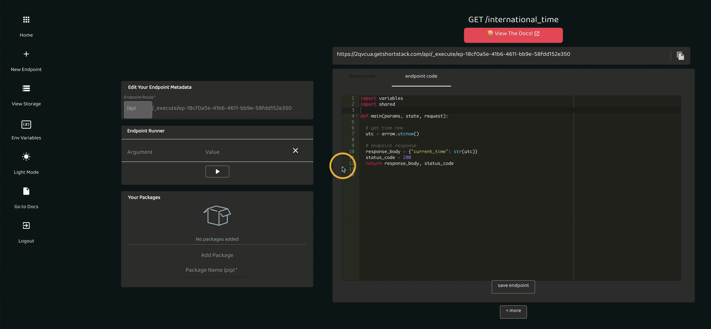

# v0.5

_released sept 1 2020_

This release was our largest yet, with two breaking changes.

## CLI

This is a huge new change! Install the CLI and use your favorite code editor with Brev! Instantly sync your changes, run the endpoints, install packages, and more. All these changes take place in the same remote environment too! So if you install package once, it'll be there forever… well, till you delete it :)

## Handle HTTP Request Types

Rather than specify every endpoint as a GET or POST, we'll pattern match the function name to handle the request type-- So long “main” function! If you have a function in the endpoint called “get", it will be run on a GET request. Wanna handle a PUT? Just add a function called “put”! 
(note: this is 1 of 2 breaking changes in this release. We no longer support "main" function as the entry point.)

## Super Simple Arguments

It's always an awkward dance to access the data being sent over to an endpoint. Now you can just put the data as input to your function. “get(x)” will automatically get you x from the query args or send an error if it doesn't exist. You can even define classes to represent a JSON body and let Brev do the rest! 
(note: this is the 2nd, and final, breaking change in this release. We no longer use the params object in functions since you can just use the variable directly)

## Stability and Improvements

- We load tested the server to new heights, it's ready to scale!
- We removed logs from the last feature since we'd rather integrate with a service and do it right. This was a tough decision but we feel it's for the better.
- Fully functional API Swagger docs are automatically generated for each project. View that at project_domain.brev.dev/docs

# v0.4

_released aug 13 2020_

## Logs

<iframe width="560" height="415" src="https://www.youtube.com/embed/UXy_Y6BXo6U" frameborder="0" allow="accelerometer; autoplay; encrypted-media; gyroscope; picture-in-picture" allowfullscreen></iframe>
You can view your endpoint logs by project using the Logs view from the navbar.

## Endpoint Runner Enhancements

<iframe width="560" height="415" src="https://www.youtube.com/embed/CkcY-a5lGYw" frameborder="0" allow="accelerometer; autoplay; encrypted-media; gyroscope; picture-in-picture" allowfullscreen></iframe>
The Endpoint Runner can be used for other HTTP calls and can include a JSON body.

# v0.3

_released july 30 2020_

## Shared Code

  
You'll notice your code editor now has tabs. Any code you write in the shared code tab is accessible by every endpoint! This code is shared on the project level.

## Environment Variables

  
Store your project's Environment Variables/Secrets in the Variables manager to securely use these values in your code! Use Variables from the left, and the "variables" object in your code.

## Rename Your Endpoints

  
You can now rename your endpoints! You could also leave the UUID if that's your thing :)

## 3rd Party Packages

  
We're really excited about this one. You can now use 3rd party packages through the Package Manager! The Package Manager is right below the Endpoint Runner on every endpoint page. Packages install per project.

# v0.2

_released july 11 2020_

---

## Projects

You can now group your endpoints by project! All of your existing endpoints will be in the "default" project. Use the project switcher (see image below) to navigate between projects or create new ones.

## Fresh Coat of Paint

You'll also notice a simpler UI, with the endpoint runner that can be toggled away. Copying the endpoint now also copies your query arguments if any! Dark mode & light mode got a lift :)
